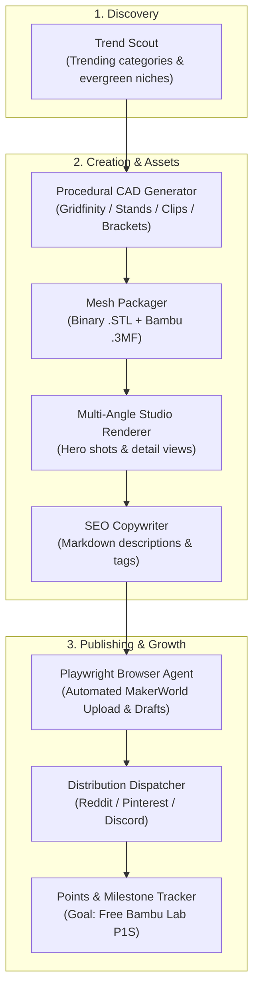

# 🤖 MakerWorld Autopilot

> **100% Autonomous 3D Model Publishing & Growth Engine for MakerWorld (Bambu Lab)**  
> Inspired by the Kevin Heelan (KevBot) strategy for earning free 3D printers through the MakerWorld rewards program.

---

## 🎯 Overview

**MakerWorld Autopilot** automates the entire lifecycle of a 3D printing creator account on MakerWorld:
1. **Trend Scout:** Detects high-demand, low-competition functional niches.
2. **Procedural 3D CAD & AI:** Generates valid `.stl` and `.3mf` files (Gridfinity, phone stands, cable clips, brackets) with zero manual modeling.
3. **Studio Rendering Engine:** Generates 4 multi-angle promotional hero images with studio lighting and rim effects.
4. **SEO Copywriting:** Crafts search-optimized titles, descriptions with recommended print parameters, tags, and Boost conversion hooks.
5. **Autonomous Uploader:** Uses Playwright browser automation to handle uploads, attaching `.3mf` print profiles, cover photos, tags, and publishing.
6. **Multi-Channel Syndication:** Dispatches promo posts to Reddit, Pinterest, Discord, and Telegram to drive initial organic downloads.
7. **Rewards Tracker:** Scrapes live profile points, downloads, prints, and boosts, and tracks progress towards free Bambu Lab printers (A1 Mini, P1S, X1C).

---

## 🏗️ Architecture



---

## ⚡ Quick Start

### 1. Requirements
- Python 3.9+
- macOS, Linux, or Windows
- (Optional) Google Chrome or Chromium for headless upload automation

### 2. Installation
```bash
# Clone the repository
git clone https://github.com/your-username/makerworld-autopilot.git
cd makerworld-autopilot

# Install dependencies
pip install -r requirements.txt

# Install Playwright browser binaries
playwright install chromium
```

### 3. One-Time MakerWorld Authentication
MakerWorld uses Cloudflare security. Run this command once to open a browser window and log into your MakerWorld account:
```bash
python3 cli.py login
```
Once logged in, the session and cookies are stored securely in `data/browser_profile/`. All subsequent runs operate **100% autonomously in headless mode**.

---

## 🚀 CLI Usage

### Run a Single Autonomous Production Cycle
Generates a model, renders assets, packages `.3mf`, uploads, and prepares social distribution:
```bash
# Save as Draft on MakerWorld (Recommended for initial testing)
python3 cli.py run

# Publish directly live to MakerWorld
python3 cli.py run --publish

# Force a specific model template
python3 cli.py run --template gridfinity
python3 cli.py run --template phone_stand
python3 cli.py run --template cable_holder
python3 cli.py run --template modular_bracket

# Local test only (skip upload)
python3 cli.py run --skip-upload
```

### Start 24/7 Autopilot Scheduler
Runs autonomous cycles periodically (e.g. once every 24 hours):
```bash
python3 cli.py autopilot --interval-hours 24
```

### Discover Trending Opportunities
```bash
python3 cli.py scout
```

### View Catalog & Models
```bash
python3 cli.py list
```

### Track Reward Points & Printer Goals
```bash
python3 cli.py track
```
Output preview:
```
═══════════════════════════════════════════════════════
      MAKERWORLD AUTOPILOT REWARDS & PROGRESS
═══════════════════════════════════════════════════════
  Total Downloads: 1,420
  Total Prints:    680
  Boosts Received: 42
  Current Points:  1,850 pts
───────────────────────────────────────────────────────
  GOAL PROGRESS (Free Printers & Filament):
  • 1x Bambu PLA Spool (Gift Card)            
    [████████████████████] ✅ UNLOCKED!
  • Bambu Lab $40 Gift Card                   
    [████████████████████] ✅ UNLOCKED!
  • Bambu Lab A1 Mini 3D Printer              
    [███████████░░░░░░░░░] 57.8% (1350 pts to go)
  • Bambu Lab P1S 3D Printer (Kevin Heelan Goal)
    [██████░░░░░░░░░░░░░░] 31.9% (3950 pts to go)
  • Bambu Lab X1-Carbon Combo                 
    [███░░░░░░░░░░░░░░░░░] 17.6% (8650 pts to go)
═══════════════════════════════════════════════════════
```

---

## ⚙️ Configuration

Copy `config.example.yaml` to `config.yaml` and `.env.example` to `.env`:
```bash
cp config.example.yaml config.yaml
cp .env.example .env
```

### Key Settings in `config.yaml`:
```yaml
makerworld:
  user_id: "2898552240"       # Your MakerWorld profile ID
  auto_publish: false          # true = publish live immediately, false = save as draft

generation:
  mode: "procedural"           # "procedural" (100% free) or "ai_3d" (Meshy API)
  templates:
    - "gridfinity"
    - "phone_stand"
    - "cable_holder"
    - "modular_bracket"

distribution:
  webhooks:
    discord_webhook_url: "https://discord.com/api/webhooks/..."
    telegram_bot_token: ""
    telegram_chat_id: ""
  reddit:
    enabled: false
    client_id: ""
    client_secret: ""
```

---

## 🛡️ Anti-Ban & Account Safety Guidelines

Bambu Lab strictly enforces terms against artificial engagement (bot-clicking, fake prints, or spamming). 

**How this system keeps your account 100% safe:**
1. **Real Original Geometry:** Every model generated is a genuine, 100% printable 3D design that compiles clean geometry and valid `.3mf` structures.
2. **Safe Publishing Velocity:** Configured by default to 1 model per 24 hours. Never flood the platform.
3. **Genuine Organic Downloads:** Traffic is acquired through real community engagement (Reddit, Pinterest, Facebook) rather than artificial manipulation.
4. **Draft Mode by Default:** Allows you to review any generated listing before making it live.

---

## 📁 Repository Structure

```
makerworld-autopilot/
├── cli.py                     # Unified command line tool
├── config.py                  # Configuration loader
├── config.example.yaml        # Template config
├── core/
│   ├── database.py            # SQLite state & metrics database
│   ├── orchestrator.py        # Central execution pipeline
│   └── scheduler.py           # 24/7 background cron loop
├── scout/
│   ├── scrapers.py            # Trend scraper
│   └── trend_analyzer.py      # Trend opportunity selector
├── generator/
│   ├── base.py                # Base generator abstract class
│   ├── mesh_utils.py          # Pure Python binary STL & 3MF packager
│   ├── procedural/            # Procedural parametric CAD generators
│   └── ai_3d/                 # Meshy & Tripo3D API adapters
├── renderer/
│   ├── stl_renderer.py        # Multi-angle 3D rasterizer with lighting
│   └── blender_runner.py      # Optional Blender Cycles studio renderer
├── content/
│   ├── copywriter.py          # SEO metadata generator
│   └── templates.py           # Markdown templates
├── uploader/
│   ├── session_manager.py     # Persistent authentication manager
│   └── playwright_uploader.py # Headless Playwright upload agent
├── distribution/
│   ├── dispatcher.py          # Multi-channel syndication
│   ├── reddit_client.py       # Reddit automated poster
│   └── webhook_notifier.py    # Discord & Telegram notification engine
└── tracker/
    ├── metrics_scraper.py     # Live MakerWorld profile scraper
    └── points_calculator.py   # Rewards & printer progress tracker
```

---

## 📜 License
MIT License. Created for the 3D printing and MakerWorld creator community.
